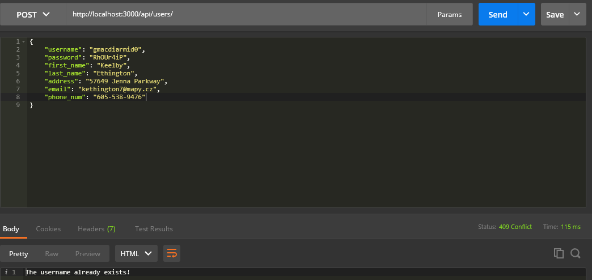
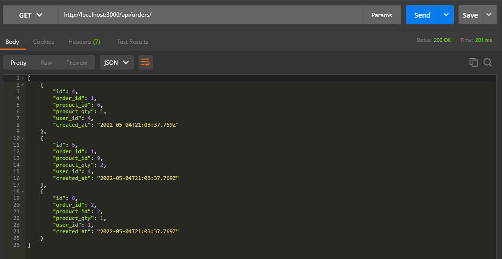
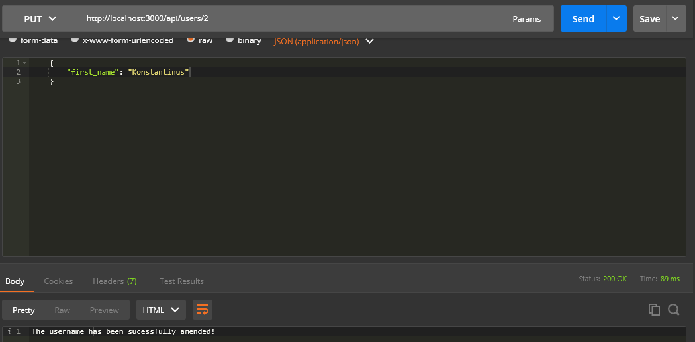
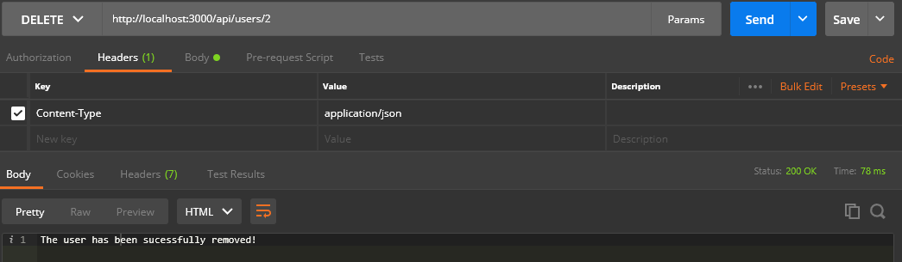

# E-Commerce App (REST API)

### General Info:

This back-end project is a music shop e-commerce REST API, that allows users to perform various CRUD operations on the SQL database that contains products, user accounts, carts, and orders tables.

### Technologies:
* Node.js
* Express.js
* PostgreSQL

### Technologies (Others):
* Postman

### Preview:
CREATE           |  READ
:-------------------------:|:-------------------------:
 | 

UPDATE           |  DELETE
:-------------------------:|:-------------------------:
 | 